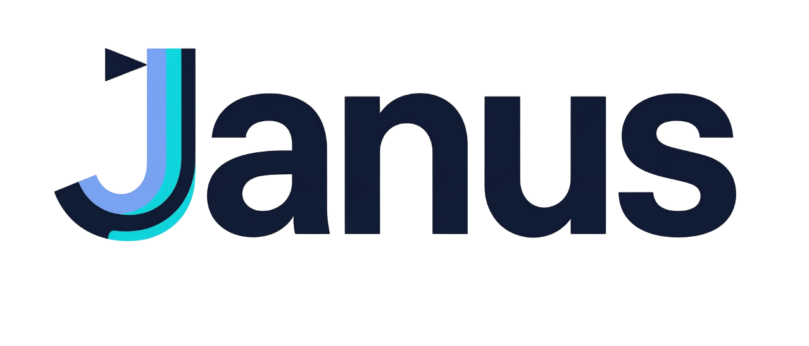

<div align="center">

<h2>
  <picture>
    
  </picture><br />
  <picture>
    
  </picture><br />
  Towards Evolving Agentic Laboratory
</h2>

<p><strong>Recruit agents, build human–agent collaboration networks, and turn complex work into reviewed deliverables.</strong></p>
<p>
  
  
  
  
  
</p>

<p>
  <a href="#-quick-start"></a>
  <a href="docs/self-hosting.md"></a>
</p>

<p>
  <a href="https://trendshift.io/repositories/108597?utm_source=trendshift-badge&amp;utm_medium=badge&amp;utm_campaign=badge-trendshift-108597" target="_blank" rel="noopener noreferrer"></a>
</p>

</div>

<p align="center">
  📖 <strong>Language:</strong> <strong>English</strong> · <a href="README.zh-CN.md">简体中文</a>
</p>

---

### 🌐 From isolated assistants to an evolving laboratory

Most agent systems stop at a single conversation or a temporary group of agents. Real work needs more: people must be able to recruit specialists, combine human judgment with agent execution, preserve responsibilities across long tasks, evaluation, and continuously improve the laboratory that produced them.

### 💡 The Janus approach

**Janus is a desktop workspace for building and operating an evolving agentic laboratory.** People and agents collaborate in persistent workflows, while every Agent has visible roles, performance and leadership records, and a governed capability-version history.

https://github.com/user-attachments/assets/79b2d2e4-7704-4785-9a6a-e78d3e84d755

---

## 📰 News

- **2026-08-10** 🎉 Janus is now officially open source! Every user receives a free daily token allowance. Feel free to download the app and get started right away.
- **Task understanding** 🧭 uBuddy task intake now has longer recovery paths, safer fallback decisions, live model capability filtering, and improved profile and update interactions.
- **Recoverable execution** 🔄 Background Agent work gained isolated task workspaces, bounded recovery, persistent wake-up state, and a fully configurable model service.
- **Collaboration delivery** 🤝 Multi-Agent and cross-user tasks gained owner review, explicit member assignment, persistent task groups, stronger workspace isolation, and richer Office deliverables.

---

## 📑 Contents

- [Key Features](#-key-features)
- [uBuddy](#-ubuddy)
- [Agent Evolution](#-agent-evolution)
- [Agent Governance](#-agent-governance)
- [Quick Start](#-quick-start)
- [Self-hosting](#-self-hosting)

## ✨ Key Features

1. **Human–Agent Collaboration** — Connect people, uBuddies, and Agents in shared task groups with direct communication and cross-user delegation.

2. **Persistent Task Orchestration** — Turn goals into direct work, specialist assignments, or dependency-aware multi-Agent workflows with durable context and review.

3. **Governed Agent Evolution** — Improve individual Agents and reusable cohort capabilities through review, evaluation, controlled rollout, adoption, and rollback.

4. **Visible Talent Lifecycle** — Track recruitment, roles, performance, leadership, and Skill/Memory versions as distinct, auditable mechanisms.

5. **Deliverable-Centered Workspaces** — Work inside user-selected projects and return reviewable research, project changes, and editable artifacts.

## 🔮 uBuddy

uBuddy reduces repetitive, low-information coordination while preserving valuable human collaboration. It directly addresses the **One-to-N collaboration problem**: one goal can be structured, delegated, tracked, and consolidated across multiple users and Agents, with people involved only when judgment is required.

| 🧭 Capability | ⚙️ Action | ⚡ Result |
| --- | --- | --- |
| **Task briefing** | Structure goals, files, constraints, and acceptance criteria. | One clear brief. |
| **One-to-N orchestration** | Delegate, assign, sequence, and consolidate. | Coordinated multi-party delivery. |
| **Decision escalation** | Handle updates, handoffs, and recoverable issues. | Reserve human attention for critical decisions. |

## 🧬 Agent Evolution

Janus treats Agent capability as a governed, versioned process rather than a fixed prompt. Evolution is driven by real work evidence and remains connected to recruitment, evaluation, and responsibility within the laboratory.

| ⚙️ Mechanism | 🎯 Subject or output | 💡 Purpose |
| --- | --- | --- |
| **Personal evolution** | A recruited Agent | Adapt Skills and Memory to owner-specific work and feedback. |
| **Cluster evolution** | An eligible active Agent cohort | Derive reusable, privacy-aware improvements from shared work evidence. |
| **Talent Market** | Approved cluster outputs | Validate and publish versions for adoption or rollback. |

## 📜 Agent Governance

Janus connects three mechanisms without treating them as a single automatic chain:

| 🧭 Layer | 🎯 Responsibility | ⚙️ Actions |
| --- | --- | --- |
| **Employee lifecycle** | Laboratory–Agent relationship | Recruit, assign, deactivate, reactivate, or dismiss. |
| **Performance and leadership** | Readiness, contribution, and responsibility | Assess, promote, set leadership levels, and apply decisions. |
| **Capability evolution** | Governed Skill and Memory versions | Evolve, review, activate, monitor, adopt, or roll back. |

## 🚀 Quick Start

Installation packages for supported operating systems are available from [GitHub Releases](https://github.com/iLearn-Agent/Janus/releases).

Janus is ready to use after installation, with a free daily token allowance for every user 🎉. 

For custom model service settings, follow the configuration guide below.

### 🍎 Launch on macOS

The current macOS build is not signed or notarized. After moving `Janus.app` to `/Applications`, run the following commands in Terminal to launch it:

```bash
xattr -cr /Applications/Janus.app
codesign --force --deep --sign - /Applications/Janus.app
open /Applications/Janus.app
```

### ⚙️ Configure inside Janus

1. Open **Settings → Account & Permissions → Model Service**.
2. Enter the Provider's API URL, usually ending in `/v1`.
3. Enter the API Key.
4. Click **Save and Test**. Janus checks connectivity and loads the models and reasoning options exposed by the Provider.

The Provider must support the current backbone's Responses API contract. If the current default model is not exposed by that Provider, select one from the refreshed model menu.

### 📁 Configure with local files

Development configuration files:

```text
workspace/config/codex/config.toml
workspace/config/codex/auth.json
```

Packaged applications use the same `config/codex` structure inside the Janus user profile. Typical locations are:

```text
Windows: %USERPROFILE%\.janus\config\codex\
macOS:   ~/.janus/config/codex/
Linux:   ~/.janus/config/codex/
```

Start from the generated `config.toml.template`. Normally you only need to replace the `base_url` value; keep the existing model fields unless the Provider uses different model IDs.

Update the active Provider block in `config.toml`:

```toml
[model_providers.custom]
name = "custom"
base_url = "https://provider.example.com/v1"
wire_api = "responses"
requires_openai_auth = true
env_key = "OPENAI_API_KEY"
request_max_retries = 4
stream_max_retries = 5
```

`auth.json`:

```json
{
  "OPENAI_API_KEY": "your-api-key"
}
```

After saving the two files, return to **Model Service** and run the connection test. Credentials remain in the current desktop profile.

## 🌍 Self-hosting

Self-hosting is needed for shared accounts, laboratory workspaces, messaging, cross-user delegation, synchronized collaboration, shared files, and shared evolution services. The supported Community deployment uses PostgreSQL, MinIO, a Migrator, the Cloud API, an isolated Evolution Worker, and Caddy through Docker Compose.

Operators should prepare a Linux host with Docker Compose, a public domain, SMTP delivery, backups, and private service credentials. Runtime databases, object data, user records, and production secrets are not included in this repository and must never be committed to Git.

- [Self-hosting guide (English)](docs/self-hosting.md)
- [自建服务器指南（简体中文）](docs/self-hosting.zh-CN.md)

---

<div align="center">

<p><strong>Thanks for visiting ✨ Janus</strong></p>

<p></p>

</div>
